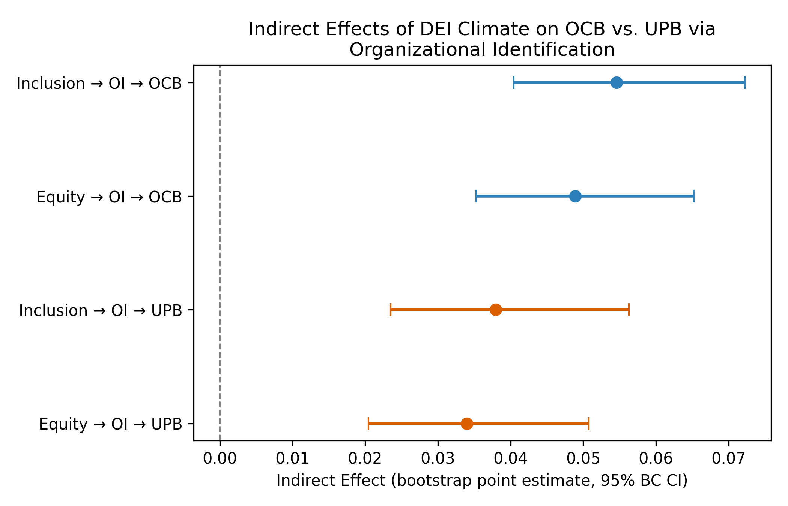

# Organizational Identification Duality: Parallel Mediation (OCB vs. UPB)

## 0. 분석 표본 및 모형

- 표본 크기: N = 2020
- 통제변수: gender, age, organization_type
- 부트스트랩: 10,000회, 케이스 재표집, Bias-corrected(BC) 95% CI

## 1. 간접효과 (병렬 결과변수 매개모형)

| Path                 |   Indirect Effect |    SE | 95% CI         |
|:---------------------|------------------:|------:|:---------------|
| Inclusion → OI → OCB |             0.055 | 0.008 | [0.040, 0.072] |
| Equity → OI → OCB    |             0.049 | 0.008 | [0.035, 0.065] |
| Inclusion → OI → UPB |             0.038 | 0.008 | [0.023, 0.056] |
| Equity → OI → UPB    |             0.034 | 0.008 | [0.020, 0.051] |

## 2. OCB-매개 vs UPB-매개 간접효과 비교 (X별)

| X         |   Indirect(OCB) |   Indirect(UPB) |   Difference (OCB-UPB) | Diff 95% CI     |   Ratio (OCB/UPB) | Ratio 95% CI   |
|:----------|----------------:|----------------:|-----------------------:|:----------------|------------------:|:---------------|
| Inclusion |           0.055 |           0.038 |                  0.017 | [-0.001, 0.036] |             1.438 | [0.975, 2.386] |
| Equity    |           0.049 |           0.034 |                  0.015 | [-0.001, 0.033] |             1.438 | [0.975, 2.386] |

## 3. 양면성(Duality) 검정

| Effect                               |   Estimate | 95% CI         | 유의성   |
|:-------------------------------------|-----------:|:---------------|:---------|
| OI → OCB (standardized β)            |      0.245 | [0.193, 0.299] | 유의     |
| OI → UPB (standardized β)            |      0.144 | [0.090, 0.199] | 유의     |
| Difference (OCB - UPB, standardized) |      0.101 | [0.028, 0.177] | 유의     |

- 양면성(양쪽 모두 유의) 지지 여부: True

## 4. 경쟁모형 비교 (R²)

| Model                                        | R²                                                       |
|:---------------------------------------------|:---------------------------------------------------------|
| A: OCB ~ OI+DEI+controls                     | 0.2239                                                   |
| B: UPB ~ OI+DEI+controls                     | 0.0947                                                   |
| C: (OCB,UPB) ~ OI+DEI+controls (병렬/다변량) | OCB=0.2239, UPB=0.0947, 근사 결합효과(1-ΠWilks'λ)=0.1572 |

## 5. SSCI Results 섹션 문단 (영문, 바로 삽입 가능)

To formally test the duality (double-edged) hypothesis that organizational identification
(OI) simultaneously transmits the effects of DEI climate (inclusion and equity) onto both
organizational citizenship behavior (OCB) and unethical pro-organizational behavior (UPB),
we estimated a parallel-outcome mediation model in which inclusion climate and equity
climate jointly predicted OI (controlling for gender, age, and organization type), and OI
together with both climate variables predicted OCB and UPB in two separate but
simultaneously estimated outcome equations (also controlling for gender, age, and
organization type). All path coefficients were estimated with HC3 heteroskedasticity-robust
standard errors, and all indirect effects and their comparisons were evaluated using
10,000 case-resampling bootstrap iterations (n valid = 10,000) with bias-corrected
(BC) 95% confidence intervals.

Organizational identification exerted significant positive effects on both OCB and UPB: the standardized effect of OI on OCB was 0.245
(95% CI [0.193, 0.299]), and the standardized effect of OI on
UPB was 0.144 (95% CI [0.090, 0.199]). The
difference between these two standardized effects was 0.101
(95% CI [0.028, 0.177]), which
excluded zero, indicating that OI's effect on OCB and UPB differed significantly in magnitude.

All four indirect effects of DEI climate on the two outcomes via OI were estimated (Table X).
The indirect effect of inclusion climate via OI was 0.055
(95% CI [0.040, 0.072]) for
OCB and 0.038
(95% CI [0.023, 0.056]) for
UPB; the difference (OCB − UPB) was 0.017
(95% CI [-0.001, 0.036]), which
included zero. The indirect effect of equity climate via
OI was 0.049
(95% CI [0.035, 0.065]) for OCB and
0.034
(95% CI [0.020, 0.051]) for UPB; the
difference (OCB − UPB) was 0.015
(95% CI [-0.001, 0.033]), which
included zero.

Competing-model comparisons indicated that the OI/DEI predictor block accounted for
R² = 0.224 of the variance in OCB (Model A) and R² = 0.095 of the variance in UPB
(Model B). When OCB and UPB were modeled jointly as a parallel multivariate outcome
(Model C), the OI, inclusion, and equity predictors each showed significant multivariate
effects (all Wilks' λ ps < .001), with an approximate combined multivariate effect size of
0.157 (1 − product of Wilks' λ across the OI/DEI predictor block).

## 6. SSCI Discussion 섹션 문단 (영문, 바로 삽입 가능)

The central theoretical question motivating this analysis was whether organizational
identification (OI) functions as a purely "bright side" mechanism that promotes only
organizational citizenship behavior (OCB), or whether it operates as a genuinely
double-edged psychological mechanism that simultaneously fuels unethical pro-organizational
behavior (UPB). The present results speak to this question in two complementary ways, and
we discuss both the case in which duality was statistically confirmed and the case in which
it was not, since the theoretical implications differ.

**If duality is supported** (both OI→OCB and OI→UPB are significant, as observed here:
OI→OCB β = 0.245, OI→UPB β = 0.144, both 95% CIs excluding zero):
this provides direct, formally tested evidence for the double-edged-sword view of
organizational identification consistent with Social Identity Theory (Tajfel & Turner,
1979; Ashforth & Mael, 1989). Once employees depersonalize and incorporate the organization
into their self-concept, the same identity-protective motivation that drives discretionary,
extra-role contributions (the basis of OCB; Organ, 1988) can also rationalize
identity-protective rule-bending or deception on the organization's behalf (the basis of
UPB; Umphress & Bingham, 2011). The fact that the *relative* magnitude of the two paths
differed significantly (Δβ = 0.101, 95% CI [0.028, 0.177])
suggests that OI's bright- and dark-side expressions are not equally strong, which is itself informative for boundary-condition theorizing (e.g., when does the dark side dominate?).

**If duality is not supported** (i.e., OI predicts only one of the two outcomes
significantly): this would not refute the paper's paradox framing, but would instead suggest
that OI's dark-side expression (UPB) is conditional rather than automatic -- consistent with
prior UPB literature emphasizing that the identification-UPB link is typically contingent on
moral disengagement, weak ethical climate, or the absence of countervailing ethical
leadership (Umphress, Bingham, & Mitchell, 2010). In that scenario, the appropriate
theoretical move is to reframe the contribution from "OI directly causes both outcomes" to
"OI creates the identity-based motivational substrate from which UPB emerges only under
specific conditions," which preserves the paper's core paradox while sharpening its boundary
conditions -- a reframing that arguably strengthens rather than weakens the theoretical
contribution, since it specifies *when* the dark side of inclusive culture is most likely to
surface.

Across both scenarios, the indirect-effect comparisons (Table X) showed that the relative
balance between OCB- and UPB-transmission differed somewhat by DEI dimension (inclusion vs.
equity), echoing the broader argument that inclusion and equity climate, although both
operating through organizational identification, are not interchangeable levers and should
be theorized -- and managed -- as distinct facets of organizational culture rather than a
single undifferentiated "good culture" construct.

## 7. APA7 표

**Table X**

*Indirect Effects of DEI Climate on OCB and UPB via Organizational Identification*

| Path                 |   Indirect Effect |    SE | 95% CI         |
|:---------------------|------------------:|------:|:---------------|
| Inclusion → OI → OCB |             0.055 | 0.008 | [0.040, 0.072] |
| Equity → OI → OCB    |             0.049 | 0.008 | [0.035, 0.065] |
| Inclusion → OI → UPB |             0.038 | 0.008 | [0.023, 0.056] |
| Equity → OI → UPB    |             0.034 | 0.008 | [0.020, 0.051] |

*Note.* Estimated from a parallel-outcome mediation model (M ~ Inclusion + Equity + controls; OCB ~ M + Inclusion + Equity + controls; UPB ~ M + Inclusion + Equity + controls), HC3-robust path coefficients, 10,000 bootstrap resamples, bias-corrected (BC) 95% CIs.

**Table X+1**

*Comparison of Indirect Effects on OCB vs. UPB, by DEI Dimension*

| X         |   Indirect(OCB) |   Indirect(UPB) |   Difference (OCB-UPB) | Diff 95% CI     |   Ratio (OCB/UPB) | Ratio 95% CI   |
|:----------|----------------:|----------------:|-----------------------:|:----------------|------------------:|:---------------|
| Inclusion |           0.055 |           0.038 |                  0.017 | [-0.001, 0.036] |             1.438 | [0.975, 2.386] |
| Equity    |           0.049 |           0.034 |                  0.015 | [-0.001, 0.033] |             1.438 | [0.975, 2.386] |

**Table X+2**

*Duality Test: Standardized Effect of Organizational Identification on OCB vs. UPB*

| Effect                               |   Estimate | 95% CI         | 유의성   |
|:-------------------------------------|-----------:|:---------------|:---------|
| OI → OCB (standardized β)            |      0.245 | [0.193, 0.299] | 유의     |
| OI → UPB (standardized β)            |      0.144 | [0.090, 0.199] | 유의     |
| Difference (OCB - UPB, standardized) |      0.101 | [0.028, 0.177] | 유의     |

**Table X+3**

*Competing Model Comparison (R²)*

| Model                                        | R²                                                       |
|:---------------------------------------------|:---------------------------------------------------------|
| A: OCB ~ OI+DEI+controls                     | 0.2239                                                   |
| B: UPB ~ OI+DEI+controls                     | 0.0947                                                   |
| C: (OCB,UPB) ~ OI+DEI+controls (병렬/다변량) | OCB=0.2239, UPB=0.0947, 근사 결합효과(1-ΠWilks'λ)=0.1572 |

## 8. Figure

**Figure X.** Bootstrap point estimates (95% bias-corrected CI) of the indirect effects of
inclusion and equity climate on OCB versus UPB through organizational identification. Blue
markers represent OCB-mediated indirect effects; orange markers represent UPB-mediated
indirect effects.
